<p align="center">
  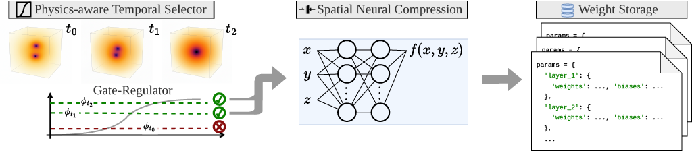
</p>

<h1 align="center">ANTIC — Adaptive Neural Temporal In-situ Compressor</h1>

<p align="center">
  <a href="#features">Features</a> •
  <a href="#methodology">Methodology</a> •
  <a href="#installation">Installation</a> •
  <a href="#quick-start">Quick Start</a> •
  <a href="#experiments">Experiments</a> •
  <a href="#configuration">Configuration</a> •
  <a href="#project-structure">Project Structure</a> •
  <a href="#license">License</a>
</p>

<p align="center">
  
  
  
  
</p>

---

**ANTIC** is a JAX-based framework for **adaptive in-situ neural compression** of PDE simulations. Instead of storing every simulation snapshot to disk, ANTIC runs alongside the solver, selecting which snapshots are physically important using **Physics-Aware Temporal Selection (PATS)**, and trains lightweight neural fields to encode them, achieving orders of magnitude compression while preserving scientific fidelity.

---

## Methodology

<p align="center">
  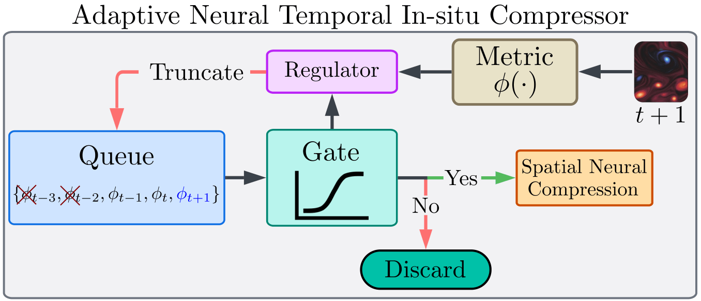
</p>

The ANTIC pipeline consists of four tightly integrated stages:

### 1. PDE Simulation (In-situ)

ANTIC couples directly with the running solver. At every time step, the solver produces a field snapshot (soliton, vorticity or bssn variables) that goes through a gating mechanism to decide if the current state is to be compressed or not. 

Three PDEs are included as the main examples:

| Solver | Equation | Method | Dimensionality |
|--------|----------|--------|----------------|
| **KdV** | Korteweg–de Vries | Pseudo-spectral + RK4 | 1D |
| **Kolmogorov** | 2D incompressible Navier–Stokes | JAX-CFD spectral (Crank–Nicolson RK4) | 2D |
| **BSSN** | Einstein field equations (3+1 decomposition) | JAX_NR backward-Euler | 3D |

### 2. Physics-Aware Temporal Selection (PATS)

A classic method for compressing intensive physical simulation consists in introducing a temporal selector, a procedure by which not all time steps are stored in memory, but a fraction of them. Ammong common techniques, many of them are indistinguishable from video compression like selections, hiding the physical meaning of the snapshots. Therefore, in this work we showcase the effectiveness of considering a selection which at its core is based on a scalar or any other physically aware quantity. Such examples are demonstrated in the following scenarios:

- **KdV Selector**: Tracks the PDE right-hand side maximum absolute value $\max|u_t| = \max|-u_{xxx} - \alpha u u_x|$. Selects frames whose activity falls in the extreme tails (top/bottom quantiles) of a rolling window.
- **Enstrophy Selector** (Kolmogorov 2D Navier-Stokes): Monitors the mean-squared vorticity (enstrophy). Uses adaptive thresholding combined with Pearson correlation to the last selected frame to detect dynamically interesting transitions. 
- **BSSN Median Selector**: Tracks the Weyl scalar magnitude $|\Psi_4|$ at the extraction radius. Implements persistent-median surge detection for dense sampling during gravitational wave bursts and aggressive skip-ahead during quiescent baselines. 

Additional temporal selectors based on entropy (JSD, spectral entropy, mutual information) and momentum (distance-based adaptive thresholds) are also available. We provide a base class and let the user design its own temporal or PATS selector depending on the case. 

### 3. Neural Field Compression

Each selected snapshot is encoded into a compact **neural implicit representation** — a small network $f_{\theta_{k}} : \mathbf{x} \mapsto u(\mathbf{x})$ that maps spatial coordinates to field values:

$$f_{\theta_{k}}(\mathbf{x}) \approx u(\mathbf{x}, t_k)$$

**Training** uses MSE loss with optional Jacobian regularization and gradient normalization for multi-objective balancing. An online normalization layer (Welford z-score or min-max with sliding window) standardizes targets before training.

We provide a base class `BaseCompressor` for defining any kind of neural compressor, having compress and decompress methods. So, the user can design and implement its own neural compressor, which doesn't need to be a neural field as used in this work, opening for the immense number of possible neural architectures to be tested.

### 4. Continual Learning and LoRA
A decisive difference when compressing one snapshot after the other is the utilization of past information, or in other words the parameters of the neural compressor. It becomes a continual learning pipeline in which the compressor improves, needing less epochs to achieve the same quality as starting from the beginning. However, continual improving can be a difficult task, and snapshots can evolve in complexity throughout compression, thus becoming more or less challenging for the neural model. Moreover, parameters continue to drift away and various known instabilities can occur. 

Instead of using all the parameters from the previous compressed snapshot, a more efficient approach would be to treat the small change between snapshots as a small change in parameters, thus suggesting a possible effectiveness for LoRA. Adopting LoRA will in most cases affect the quality of the compression, however there is no need to store all parameters, but only the LoRA matrices, thereby obtaining an improved compression. We remind here, for clarity, the generic LoRA update:

$$W' = W + AB^\top, \quad W \in \mathbb{R}^{n \times m},\; A \in \mathbb{R}^{n \times r},\; B \in \mathbb{R}^{m \times r},\; r \le \min(n, m)$$

Only the low-rank matrices $A$ and $B$ are trained and stored, reducing the storage size of the neural compressor. Periodically (every `reset_every_n` snapshots), the LoRA matrices are merged back into the base weights and the neural model is trained with all parameters to ensure the compression quality is not degraded from the continual application of LoRA.

## Features

- **In-situ compression** — runs alongside the PDE solver
- **Physics-aware selection** — PATS selects only dynamically relevant snapshots according to a physical quantity and a selection mechanism
- **LoRA fine-tuning** — efficient incremental training across time steps
- **Pydantic configuration** — Pydantic-validated YAML configs with CLI overrides
- **Checkpoint management** — Orbax-backed async I/O with filtered saves
- **Experiment tracking** — built-in Weights & Biases integration
- **Classical baselines** — SZ3, ZFP, Blosc2, MGARD compressor wrappers for comparison
- **Flax NNX** - training pipeline almost identical in style to PyTorch thanks to NNX API
---

## Experiments

### 2D Kolmogorov Flow (Navier–Stokes)

The Kolmogorov experiment simulates 2D turbulence driven by a sinusoidal body force. ANTIC selects snapshots based on enstrophy dynamics and compresses the vorticity field.

<p align="center">
  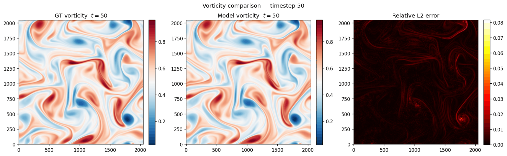
  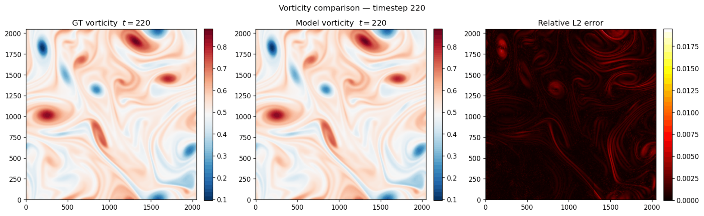
</p>
<p align="center">
  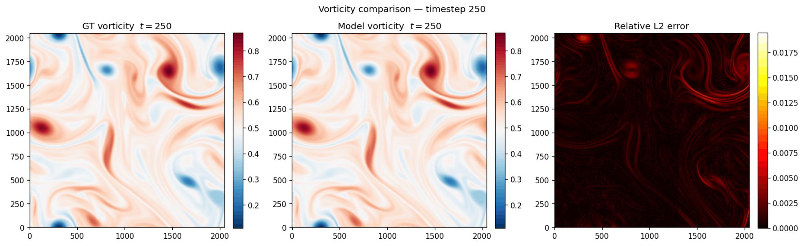
  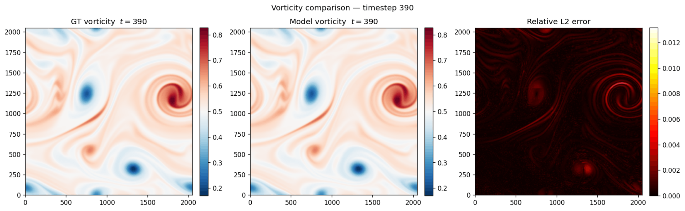
</p>
<p align="center">Fig 1. Reconstructed vorticity fields at different simulation times, showing the neural compressor faithfully capturing turbulent structure evolution.</p>

<p align="center">
  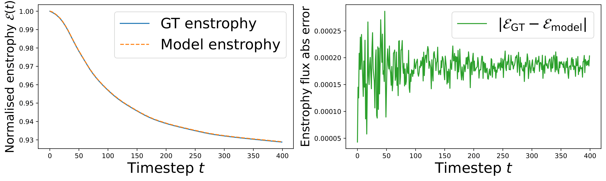
</p>
<p align="center">Fig 2. Comparison in enstrophy between the original trajectory and the compressed variant. The neural model produces an excellent match, highlighting the temporal coherence in capturing the physics of the Kolmogorov flow.</p>

### BSSN Numerical Relativity

The BSSN experiment handles 3D binary black hole mergers using the BSSN formulation of Einstein's field equations.

<p align="center">
  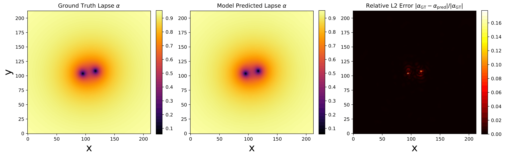
  
</p>
<p align="center">
  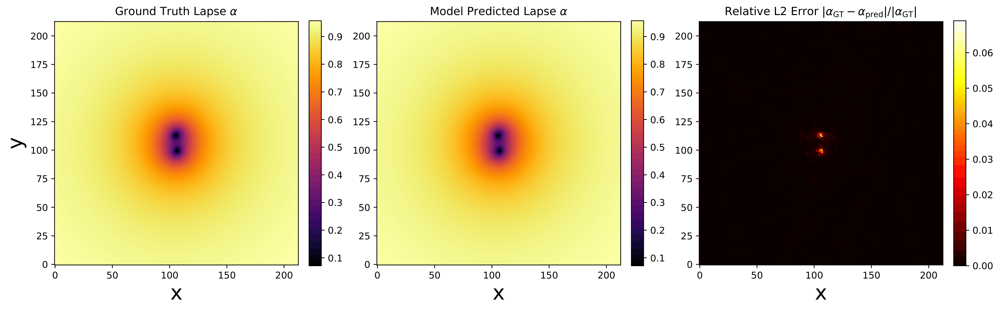
  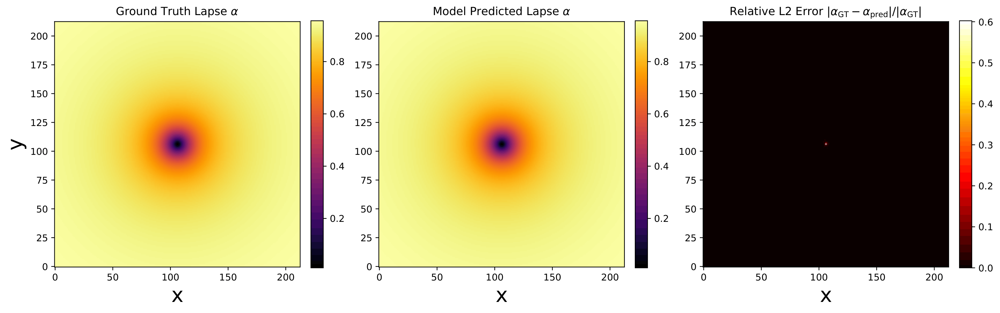
</p>
<p align="center">Fig 3. Lapse function comparison between the original trajectory and the neural reconstruction at different timesteps, demonstrating high-fidelity compression.</p>

<p align="center">
  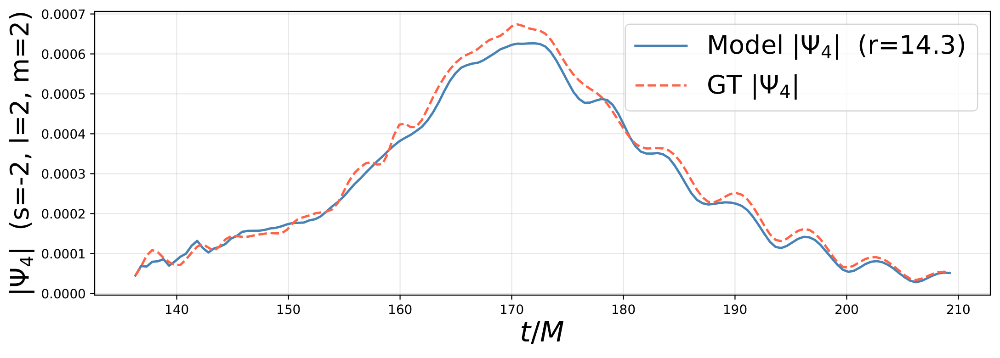
</p>
<p align="center">Fig 4. Comparing the Weyl scalar magnitude between the original trajectory and the neural compressor. The temporal reconstructed quantity is in very good agreement with small differences, but more esentially capturing the correct trend in the Weyl scalar magnitude before and throughout the merger event.</p>

<p align="center">
    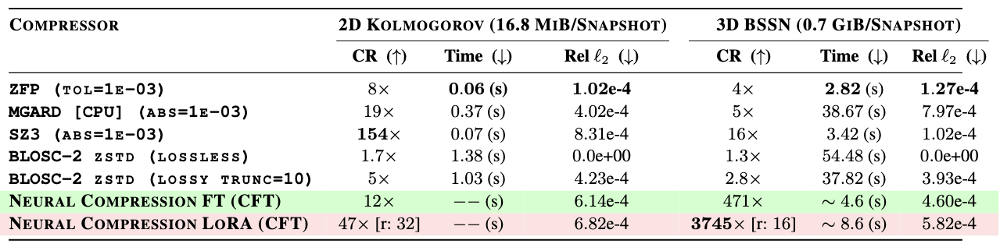
</p>

<p align="center">Table 1. Neural field compressor compared against a list of well established classical compressors. CR stands for compression ratio and second column is the compression time. All compressors have been tested on CPU, although most of them have GPU support. </p>

---

## Installation

### Prerequisites

- Python 3.10+
- A JAX-compatible accelerator (GPU recommended, CPU supported)

### 1. Clone the Repository

```bash
git clone https://github.com/AndreiB137/ANTIC.git
cd ANTIC
```

### 2. Create a Virtual Environment

```bash
# Using conda (recommended)
conda create -n antic python=3.10
# Or other versions > 3.10.
conda activate antic

# Or using venv
python -m venv .venv
source .venv/bin/activate
```

### 3. Install JAX

Install JAX with the appropriate accelerator support for your system. See the [official JAX installation guide](https://jax.readthedocs.io/en/latest/installation.html) for details.

```bash
# CPU only
pip install jax jaxlib

# NVIDIA GPU (CUDA 12)
pip install jax[cuda12]

# NVIDIA GPU (CUDA 13)
pip install jax[cuda13]

```

### 4. Install Dependencies

```bash
pip install -r requirements.txt
```

### 5. (Optional) Install JAX_NR for BSSN Experiments

The BSSN numerical relativity solver requires the **JAX_NR** library. Clone it and install it alongside ANTIC:

```bash
# Clone JAX_NR into the parent directory (or anywhere on your PYTHONPATH)
git clone https://github.com/AndreiB137/JAX_NR.git

# Add JAX_NR to your Python path
export PYTHONPATH="${PYTHONPATH}:$(pwd)/JAX_NR"

# Add the current workspace to your PYTHONPATH
export PYTHONPATH="${PYTHONPATH}:$(pwd)"

```

### 6. (Optional) Install Classical Compressors

For baseline comparisons with classical lossy compressors:

```bash
pip install zfpy        # ZFP compression
pip install blosc2      # Blosc2 compression
pip install pysz        # SZ3 compression
# MGARD requires manual pybinding installation — see https://github.com/CODARcode/MGARD for the official C++ source code.
```

### 7. Some info regarding version compatibility

The code was executed successfully with the latest `jax` (0.9.2), `flax` (0.12.6), `optax` (0.2.8), `orbax` (0.11.33). However, consider the soap optimizer as experimental or try to downgrade to an older `flax` version in order to use it.

---

## Quick Start

### Run a KdV Soliton Experiment

```bash
python main.py --config configs/kdv.yaml
```

### Run a 2D Kolmogorov Flow Experiment

```bash
python main.py --config configs/kolmogorov.yaml
```

### Run a BSSN Numerical Relativity Experiment

> **Note:** Requires JAX_NR to be installed (see [Installation](#installation) step 5).

```bash
# Set the path to your BSSN initial data
python main.py --config configs/bssn.yaml \
    --override solver.initial_data_path=/path/to/initial_data
```

### Override Configuration from the CLI

Any configuration parameter can be overridden via dot-separated `key=value` pairs:

```bash
python main.py --config configs/kdv.yaml \
    --override solver.N=1024 \
               training.initial_epochs=1000 \
               training.filter=lora \
               training.rank=8 \
               wandb.enabled=true
```

### Resume from Checkpoint

ANTIC automatically detects existing checkpoints in `training.save_dir` and resumes training:

```bash
# First run (interrupted or completed)
python main.py --config configs/kolmogorov.yaml

# Re-running picks up where it left off
python main.py --config configs/kolmogorov.yaml \
                --override training.stop_at=...
```

Specify `training.stop_at` to be greater than the previous. `stop_at` represents the simulatio time at which to stop the compression. If `stop_at='inf'`, then ANTIC pipeline will finish only when the simulation has reached the `total_time`.

---

## Configuration

All experiments are configured via YAML files validated by Pydantic schemas. Each config specifies six sections:

```yaml
seed: 42

solver: kolmogorov          # or: kdv, bssn

model:
  name: mlp                 # mlp | mlp_plus | siren | wire
  input_dim: 2
  output_dim: 1
  hidden_dim: 64
  num_hidden_layers: 5
  fourier_emb_dim: 128      # MLP/MLP+ only
  fourier_emb_scale: 7.0    # MLP/MLP+ only

optimizer:
  name: adamw                # adamw | adamaxw | nadamw | lamb | lion | novograd | lars | adan | soap
  learning_rate: 1.0e-2
  weight_decay: 1.0e-4
  scheduler:
    type: cosine_decay       # constant | cosine_decay | warmup_cosine_decay | exponential_decay
    end_lr: 1.0e-5

training:
  initial_epochs: 200        # epochs for the first snapshot
  subsequent_epochs: 100     # epochs for later snapshots (LoRA)
  rank: 8                    # rank of LoRA matrices
  reset_every_n: 50          # Only used when filter = lora
  batch_size: 10000          # null for full-batch
  filter: all                # all | lora | hidden_layers
  stop_at: 2.0              # stop at this physical time, use 'inf' for no stop
  save_dir: my_experiment/

normalization:
  enabled: true
  method: min-max            # z-score | min-max

selector:
  type: kolmogorov           # kdv | kolmogorov | bssn | none
  corr_threshold: 0.90
  window_size: 5

wandb:
  enabled: false
  project: ANTIC
  name: my-experiment
  tags: [kolmogorov, mlp+, all]
  log_every: 1
```

See [`configs/schema.py`](configs/schema.py) for the full Pydantic schema with all available parameters and defaults.

---

## Project Structure

```
ANTIC/
├── main.py                          # Entry point — parses config, dispatches experiment
├── requirements.txt                 # Python dependencies
├── configs/
│   ├── schema.py                    # Pydantic experiment configuration schema
│   ├── utils.py                     # Config utilities (optimizer/model builders)
│   ├── kdv.yaml                     # KdV experiment config
│   ├── kolmogorov.yaml              # Kolmogorov experiment config
│   ├── bssn.yaml                    # BSSN experiment config
│   ├── helper_cfg/                  # Discriminated union configs
│   │   ├── model.py                 #   Model configs (MLP, SIREN, WIRE)
│   │   ├── selector.py              #   Selector configs per PDE
│   │   └── solver.py                #   Solver configs per PDE
│   └── solver/                      # Solver-specific YAML defaults
│       ├── kdv.yaml
│       ├── kolmogorov.yaml
│       └── bssn.yaml
├── experiments/
│   ├── kdv.py                       # KdV in-situ compression loop
│   ├── kolmogorov.py                # Kolmogorov in-situ compression loop
│   └── bssn.py                      # BSSN in-situ compression loop
├── solver/
│   ├── solver.py                    # Base solver interface
│   ├── kdv.py                       # KdV pseudo-spectral solver
│   ├── kolmogorov.py                # 2D Navier–Stokes (JAX-CFD) solver
│   └── bssn.py                      # BSSN numerical relativity solver (JAX_NR)
├── neural_compressor/
│   ├── base_compressor.py           # Abstract compressor interface
│   ├── neural_field_compressor.py   # Core neural field train/decompress logic
│   ├── normalization.py             # Online Welford & min-max normalization
│   └── utils.py                     # Filter presets & state extraction
├── nnx_models/
│   ├── mlp.py                       # MLP with Fourier embedding
│   ├── mlp_plus.py                  # MLP + LayerNorm
│   ├── siren.py                     # Sinusoidal representation network
│   ├── wire.py                      # Gabor wavelet implicit representation
│   ├── utils.py                     # Fourier embedding layer
│   └── lora/
│       └── utils_lora.py            # LoRA layer, add/remove/merge utilities
├── pats/
│   ├── pats.py                      # PATS orchestrator
│   ├── no_selector.py               # Dummy class for no selector.
│   ├── kdv_selector.py              # KdV quantile-based selector
│   ├── enstrophy_selector.py        # Enstrophy-based selector (Kolmogorov)
│   └── bssn_median_selector.py      # Weyl scalar surge detector (BSSN)
├── temporal_selector/
│   ├── base.py                      # TemporalSelector base class
│   ├── entropy.py                   # Entropy/information selectors
│   ├── momentum.py                  # Distance-based momentum selector
│   ├── metrics.py                   # Metric functions (L2, MAE, Pearson, etc.)
│   └── offline.py                   # Offline temporal selection
├── param_manager/
│   ├── param_manager.py             # Orbax checkpoint save/load with filtering
│   └── utils.py                     # Filter resolution utilities
├── classical_compressor/
│   └── compressor.py                # SZ3, ZFP, Blosc2, MGARD wrappers
├── misc/                            # Figures and visual assets
```

1. **Step**: The PDE solver advances the simulation by one time step.
2. **Decide**: PATS evaluates a physics-aware activity metric and decides keep or skip.
3. **Normalize**: If kept, online statistics (mean/std or min/max) are updated.
4. **Compress**: A neural field is trained to fit the snapshot.
5. **Save**: The checkpoint is written to disk with the selected filter strategy.
6. **Repeat**: The loop continues until the target physical time is reached.

---

## Citation

If you use ANTIC in your research, please cite:

```bibtex
@misc{cranganore2026antic,
      title={ANTIC: Adaptive Neural Temporal In-situ Compressor}, 
      author={Sandeep Suresh Cranganore and Andrei Bodnar, Gianluca Galletti, Fabian Paischer, Johannes Brandstetter},
      year={2026},
      eprint={},
      archivePrefix={arXiv},
      primaryClass={cs.LG},
      url={}, 
}
```

---

## License

This project is licensed under the MIT License. See [LICENSE](LICENSE) for details.
